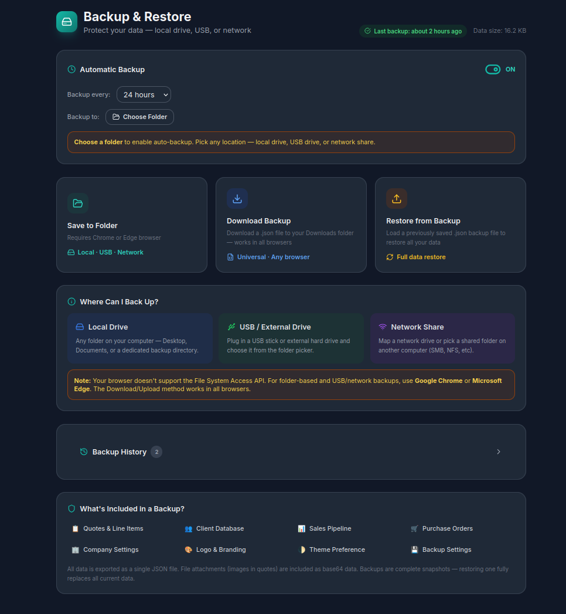
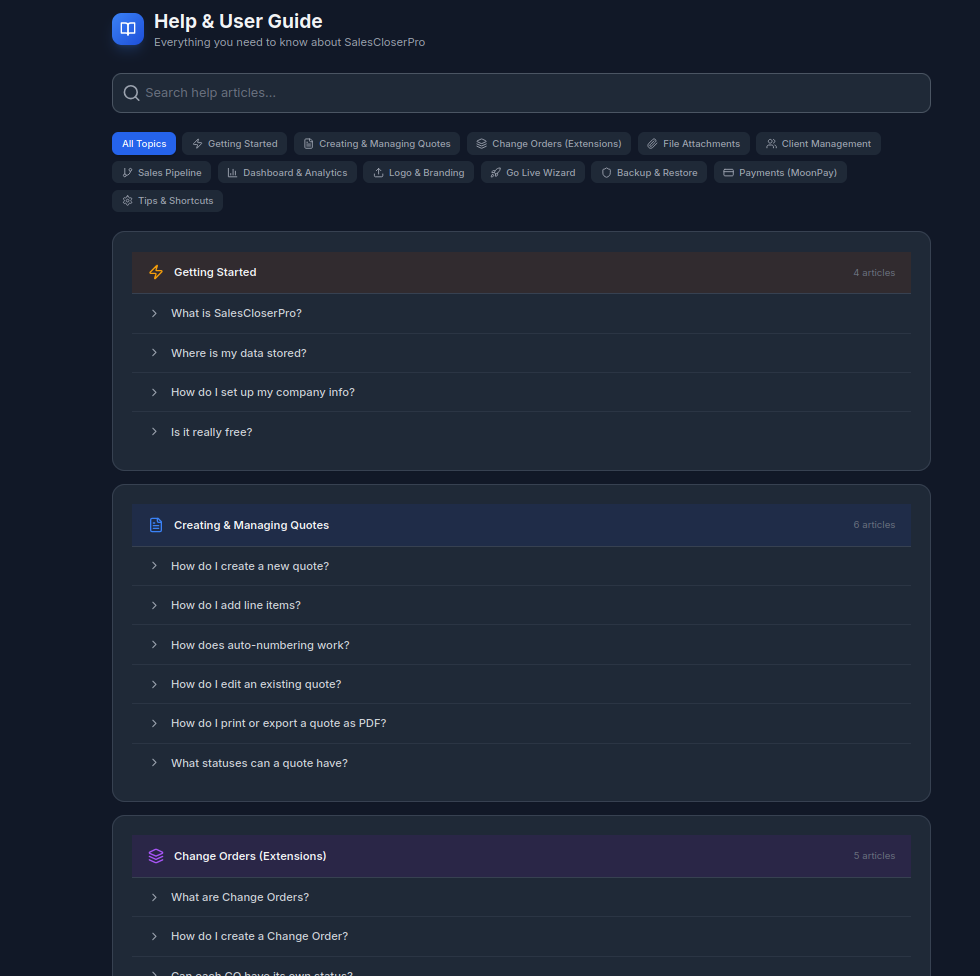
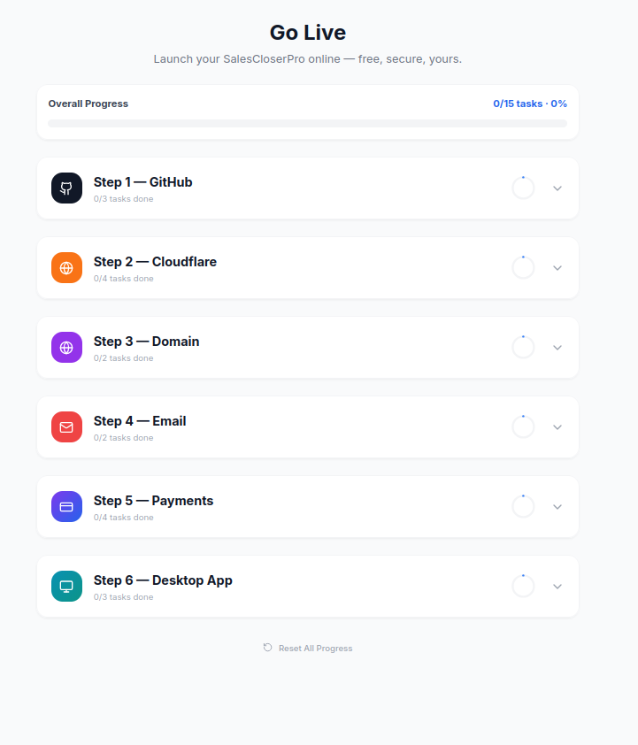

<p align="center">
  
</p>

<h1 align="center">salescloserpro — Close More. Stress Less. 💪</h1>

<p align="center">
  <strong>Free, open-source sales quoting, CRM, pipeline, purchase orders & invoicing — browser + desktop.</strong><br/>
  <em>Built with ⚛️ React · ⚡ Vite · 🎨 Tailwind · 🐻 Zustand · 🖥️ Electron — zero backend, zero sign-up, works offline.</em>
</p>

<p align="center">
  <a href="https://github.com/llmadvisor/salescloserpro/blob/main/LICENSE"></a>
  <a href="https://github.com/llmadvisor/salescloserpro"></a>
  <a href="https://salescloserpro.com"></a>
  <a href="https://chatgpt.com/g/g-69930ae1d2748191a9c47556b8ceae82-salescloserpro-ai"></a>
  <a href="#️-desktop-app--electron"></a>
</p>

### 📸 Screenshots

<table align="center">
  <tr>
    <td align="center"><strong>📊 Dashboard</strong></td>
    <td align="center"><strong>📝 Quote Builder</strong></td>
  </tr>
  <tr>
    <td align="center"></td>
    <td align="center"></td>
  </tr>
  <tr><td colspan="2"><br></td></tr>
  <tr>
    <td align="center"><strong>🔄 Pipeline</strong></td>
    <td align="center"><strong>👥 Clients</strong></td>
  </tr>
  <tr>
    <td align="center"></td>
    <td align="center"></td>
  </tr>
  <tr><td colspan="2"><br></td></tr>
  <tr>
    <td align="center"><strong>🌙 Dark Mode</strong></td>
    <td align="center"><strong>🚀 Go Live Wizard</strong></td>
  </tr>
  <tr>
    <td align="center"></td>
    <td align="center"></td>
  </tr>
</table>

---

## 📑 Table of Contents

- [🤖 salescloserpro.ai — GPT Assistant](#-salescloserpro-ai--gpt-assistant)
- [⚡ Quick Start — Install in 60 Seconds](#-quick-start--install-in-60-seconds)
- [🖥️ Desktop App — Electron](#️-desktop-app--electron)
- [✨ Features at a Glance](#-features-at-a-glance)
- [📸 Feature Deep Dive](#-feature-deep-dive)
  - [📝 Quote Builder](#-quote-builder)
  - [📎 File Attachments](#-file-attachments)
  - [🧮 50-State Tax Engine](#-50-state-tax-engine)
  - [📊 Sales Pipeline (Kanban)](#-sales-pipeline-kanban)
  - [🔗 Pipeline ↔ Quotes ↔ PO Integration](#-pipeline--quotes--po-integration)
  - [📦 Purchase Orders & Margin Analytics](#-purchase-orders--margin-analytics)
  - [🚚 Ship-To Address on POs](#-ship-to-address-on-pos)
  - [📄 PDF Export Engine](#-pdf-export-engine)
  - [💳 Payment Processing](#-payment-processing)
  - [💾 Backup & Restore](#-backup--restore)
  - [🚀 Go Live Wizard](#-go-live-wizard)
- [🌐 Deploy Your Own (Free)](#-deploy-your-own-free)
- [🔍 SEO & Meta Tags](#-seo--meta-tags)
- [🛠️ Tech Stack](#️-tech-stack)
- [📁 Project Structure](#-project-structure)
- [🔧 Available Scripts](#-available-scripts)
- [🌙 Dark Mode](#-dark-mode)
- [💾 Data & Storage](#-data--storage)
- [🤝 Contributing](#-contributing)
- [❓ FAQ](#-faq)
- [⚖️ Copyright & Disclaimer](#️-copyright--disclaimer)
- [📄 License](#-license)

---

## 🤖 salescloserpro.ai — GPT Assistant

> 💬 Get instant help building quotes, closing deals, and using every feature — powered by OpenAI.

🎯 **[→ Launch salescloserpro.ai on ChatGPT](https://chatgpt.com/g/g-69930ae1d2748191a9c47556b8ceae82-salescloserpro-ai)**

The AI assistant can help you with:
- 📝 Building and editing quotes step by step
- 💡 Sales strategy & pricing advice
- 🔍 Finding features and navigating the app
- 📊 Understanding your pipeline, analytics, and margins
- 🚀 Deploying, configuring, and packaging your own instance
- 🖥️ Building the Electron desktop app for your OS

---

## ⚡ Quick Start — Install in 60 Seconds

### 📋 Prerequisites

| Requirement | Version | Check |
|---|---|---|
| 🟢 **Node.js** | 18+ | `node --version` |
| 📦 **npm** | 9+ | `npm --version` |
| 🌐 **Browser** | Chrome, Edge, Firefox, Safari | Any modern browser |

### 🏃 Get Running (Web)

```bash
# 1️⃣  Clone the repo
git clone https://github.com/llmadvisor/salescloserpro.git
cd salescloserpro

# 2️⃣  Install dependencies
npm install

# 3️⃣  Start the dev server
npm run dev
```

🎉 Open `http://localhost:5173` — **you're in!**

### 🏗️ Build for Production (Web)

```bash
# 📦 Create an optimized production build
npm run build

# 👀 Preview the production build locally
npm run preview
```

---

## 🖥️ Desktop App — Electron

SalesCloserPro ships as a **native desktop app** for Windows, macOS, and Linux via Electron. The app wraps the same web UI in a native window with a full application menu, OS-level window management, and all the same features — no browser required.

### 🏗️ Architecture

| File | Purpose |
|---|---|
| `electron/main.cjs` | Main process — creates `BrowserWindow` (1280 × 860, min 900 × 600), loads Vite dev server in dev mode or `dist/index.html` in production. Full application menu (File, Edit, View, Window, Help). External links open in default browser. |
| `electron/preload.cjs` | Preload script — exposes `window.electronAPI.platform` and `window.electronAPI.isElectron` via `contextBridge` for safe IPC. |
| `electron-builder.json` | Build configuration — multi-platform output (NSIS + portable for Windows, DMG for macOS, AppImage + deb for Linux). App ID: `com.llmadvisor.salescloserpro`. |
| `build/icons/` | App icons — `icon.png` (1024 × 1024), `icon.ico` (256 × 256), `icon.icns` (512 × 512). |

### 🚀 Quick Start (Desktop)

```bash
# 🖥️ Run in Electron dev mode (builds Vite first, then opens Electron)
npm run electron:dev
```

### 📦 Build Installers

```bash
# 🪟 Windows — NSIS installer + portable .exe
npm run electron:build:win

# 🍎 macOS — DMG (x64 + arm64 universal)
npm run electron:build:mac

# 🐧 Linux — AppImage + .deb package
npm run electron:build:linux

# 🌐 All platforms at once
npm run electron:build
```

All built artifacts are output to the `release/` directory.

### 🪟 Windows Output

| File | Description |
|---|---|
| `SalesCloserPro-1.0.0-Setup-x64.exe` | NSIS installer (user choice install directory) |
| `SalesCloserPro-1.0.0-x64.exe` | Portable — no install needed |

### 🍎 macOS Output

| File | Description |
|---|---|
| `SalesCloserPro-1.0.0-x64.dmg` | Intel Macs |
| `SalesCloserPro-1.0.0-arm64.dmg` | Apple Silicon (M1/M2/M3/M4) |

> ⚠️ **macOS Unsigned App Warning:** Without an Apple Developer account ($99/year), macOS builds are unsigned. Users will see a "Damaged" or "Unidentified Developer" warning. To bypass: **right-click → Open** the app, or run `xattr -cr /Applications/SalesCloserPro.app` in Terminal. Windows & Linux builds work out of the box.

### 🐧 Linux Output

| File | Description |
|---|---|
| `SalesCloserPro-1.0.0-x64.AppImage` | Run anywhere — no install needed |
| `SalesCloserPro-1.0.0-x64.deb` | Debian/Ubuntu package — `sudo dpkg -i *.deb` |

> 💡 **Note:** The `vite.config.js` uses `base: './'` so the app loads correctly from the `file://` protocol inside Electron.

---

## ✨ Features at a Glance

| | Feature | Description |
|---|---|---|
| 📝 | **Quote Builder** | Big-button UI — add Products, Services, Labor, Freight with one click |
| 🔄 | **Change Orders** | A-B-C suffix system for revision tracking on any quote |
| 📎 | **File Attachments** | Drag-and-drop uploader — images and PDFs attached to any quote |
| 🧮 | **Auto Tax Engine** | All 50 US states + DC — freight, labor & sales tax rules calculated automatically |
| 👥 | **Client CRM** | Store clients, contacts, addresses, notes — tied to every quote |
| 📊 | **Sales Pipeline** | Kanban board — Lead → Quoted → Sent → Negotiating → Won / Lost |
| 🔗 | **Data Integration** | Quotes auto-sync to pipeline; POs link to quotes for margin analysis |
| 📦 | **Purchase Orders** | Full PO system with ship-to address, margin tracking, analytics, charts |
| 💳 | **MoonPay Payments** | Accept credit card / bank / Apple Pay → crypto payments on any invoice |
| 📄 | **PDF Export** | Color-neutral branded proposals & POs — charcoal palette, 50% deposit terms |
| 💾 | **Backup & Restore** | Full JSON backup with auto-schedule, File System Access API, Firefox-safe |
| 🚀 | **Go Live Wizard** | 6-step guide: GitHub → Cloudflare → Domain → Email → Payments → Desktop App |
| 🏢 | **Company Settings** | Logo upload, company info, branding for all PDF exports |
| ❓ | **Help Center** | 12-section searchable guide with expandable FAQs |
| 🌙 | **Dark / Light Mode** | System-aware theme toggle, persisted per user, balanced for both modes |
| 🖥️ | **Desktop App** | Native Electron app for Windows, macOS, and Linux — no browser required |
| 🔍 | **SEO Ready** | Open Graph, Twitter Cards, JSON-LD structured data out of the box |

---

## 📸 Feature Deep Dive

### 📝 Quote Builder
> 🎯 The heart of SalesCloserPro — create professional quotes in minutes, not hours.

- ➕ **One-click line items** — Products, Services, Labor, Freight categories
- 🔢 **Auto-numbering** — Sequential quote numbers with configurable prefix
- 🔄 **Change order tracking** — Automatic A, B, C suffixes for revisions
- 🧮 **Real-time totals** — Subtotal, tax, and grand total update instantly
- 👤 **Client linking** — Tie every quote to a CRM client
- 📝 **Notes field** — Internal notes for context and instructions
- 📎 **File attachments** — Drag-and-drop images, PDFs, specs to any quote (see below)
- 📄 **PDF export** — One-click branded invoice/proposal generation
- 🔗 **Pipeline sync** — Saving a quote automatically creates or updates the connected pipeline deal

### 📎 File Attachments
> 📂 Attach supporting documents to any quote — images, PDFs, and spec sheets.

- 🖱️ **Drag-and-drop** — or click to browse; supports images (JPEG, PNG, GIF, WebP) and PDFs
- 📏 **Size limits** — max 5 files per quote, max 2 MB per file
- 🖼️ **Visual thumbnails** — large, centered preview grid (44 × 40 rem) so you can see what you attached
- 🗑️ **Remove** — click the ✕ on any thumbnail to detach
- 💾 **Persisted** — attachments are saved with the quote in Zustand (base64 in `localStorage`)
- 🖨️ **Print-ready** — attachments are included in the save and print payload

### 🧮 50-State Tax Engine
> 🇺🇸 Automatic sales tax calculations for all 50 US states + Washington DC.

- ✅ State-level sales tax rates for every US state
- 🚚 **Freight taxability** — knows which states tax shipping
- 🔧 **Labor taxability** — knows which states tax labor/services
- 🔄 **Auto-calculation** — tax updates in real-time as you edit quotes
- 📊 **Rate accuracy** — community-updatable JSON database in `src/data/taxDatabase.js`

### 📊 Sales Pipeline (Kanban)
> 🏗️ Visual deal tracking from first contact to closed-won.

- 🎯 **6 stages** — Lead → Quoted → Sent → Negotiating → Won → Lost
- 🎨 **Color-coded stages** — each stage has a distinct background color in both light and dark mode
- 🖱️ **Click-to-move** — advance deals through stages with one click
- 💰 **Deal values** — track expected revenue per deal
- 📝 **Notes** — add context notes to any deal
- 🔗 **Quote linking** — linked deals show the quote number and badge the connected PO
- 📈 **Win/loss tracking** — see your close rate at a glance
- 🌗 **Balanced modes** — rich card shadows and stage backgrounds in light mode, vibrant colors in dark mode

### 🔗 Pipeline ↔ Quotes ↔ PO Integration
> 🔄 All data flows together — quotes, pipeline deals, and purchase orders are fully connected.

- 📝 **Saving a quote** → automatically creates a pipeline deal (or updates the existing one)
- 💰 **Deal value** = quote grand total, always in sync
- 📊 **Pipeline stage** auto-set to "Quoted" on creation, "Won" if a PO is linked
- 🏷️ **Deal cards** display linked quote number and PO badge
- 🔄 **Startup sync** — `syncAllQuotesToPipeline()` runs on app mount to reconcile all data
- 🗑️ **Orphan cleanup** — deals missing their source quote are cleaned up automatically

**How it works under the hood:**

| Action | Store Method | Result |
|---|---|---|
| Save/update a quote | `syncQuoteToPipeline(quoteId)` | Creates or updates pipeline deal with matching `quoteId`, sets value to grand total |
| App start | `syncAllQuotesToPipeline()` | Iterates all quotes, syncs each to pipeline, removes orphaned deals |
| Link PO to quote | Automatic via pipeline | Deal marked "Won" when a PO references its quote |

### 📦 Purchase Orders & Margin Analytics
> 📈 Track costs, calculate margins, and visualize profitability.

- 📋 **Full PO creation** — vendor name, vendor contact, items, quantities, costs
- 🚚 **Ship-to address** — dedicated field for delivery destination (see below)
- 🔗 **Quote linking** — tie POs to quotes for automatic margin analysis
- 📊 **Interactive charts** — margin %, cost vs. sell price, vendor breakdown
- 📈 **Analytics dashboard** — total cost, total sell, average margin, count
- 🔍 **Search & filter** — find POs by vendor, quote, status, or keyword
- 📄 **PDF export** — professional PO document with all details and terms

### 🚚 Ship-To Address on POs
> 📍 Specify a delivery destination that is different from your company address.

- 📝 **Dedicated field** — "Ship To Address" input in the PO form, between Vendor Contact and Description
- 📄 **PDF support** — if a ship-to address is provided, the PO PDF prints it as the delivery address; if left blank, it falls back to your company address from Company Settings
- 🔄 **Edit support** — ship-to address is preserved when editing an existing PO
- 🗑️ **Reset** — cleared when the form is reset for a new PO

### 📄 PDF Export Engine
> 🖨️ Professional, color-neutral documents generated entirely client-side — no cloud, no API.

Both the **Quote/Proposal PDF** and the **Purchase Order PDF** share a refined design:

#### 🎨 Design Language
- **Color-neutral palette** — charcoal (`#1e293b`), gray (`#334155`), and white — no blue or colored branding
- **Charcoal table headers** — dark header row with white text for clarity
- **Charcoal total band** — grand total row with the same dark treatment
- **Wider margins** — 16 mm on all sides for a clean, breathable layout
- **Page numbers** — "Page X of Y" in the footer of every page
- **Company branding** — your logo and company info at the top of every document

#### 📝 Quote / Proposal PDF (`generatePDF`)
- Itemized table with description, quantity, unit price, total
- Subtotal, tax, and grand total summary
- **Terms & Payment section** — printed at the bottom of every quote:
  - 📅 Quote valid for 30 days from issue
  - 💰 50% deposit due upon PO issuance
  - 💳 Remaining balance due net 30 days
  - 📜 Subject to standard terms and conditions

#### 📦 Purchase Order PDF (`generatePO_PDF`)
- Vendor details, PO number, date
- Ship-to address (or company address fallback)
- Itemized table with description, quantity, unit cost, total
- **No margin summary** — margins are internal analytics only, never shown on the PO document
- **Payment terms block** with 5 terms:
  1. 💰 50% deposit due upon PO issuance; remaining balance due net 30 days
  2. 📦 Delivery per agreed schedule
  3. ⚠️ Inspect goods within 48 hours of delivery
  4. 📜 Subject to standard purchase terms
  5. ✅ This PO is not valid until signed by both parties
- **Signature lines** — Authorized Buyer and Vendor Acceptance with date fields

### 💳 Payment Processing
> 💰 Accept payments on any invoice via MoonPay integration.

- 💳 **Credit/debit cards** — Visa, Mastercard, Amex
- 🏦 **Bank transfers** — ACH / wire
- 🍎 **Apple Pay** — one-tap mobile payments
- 🪙 **Crypto settlement** — funds settle as USDC (stablecoins) to your wallet
- 🔐 **Secure** — payments handled by MoonPay's PCI-compliant infrastructure

### 💾 Backup & Restore
> 🛡️ Never lose your data — comprehensive backup system with auto-scheduling.

- 📥 **One-click download** — full JSON export of all data
- 📤 **File restore** — import any backup JSON to restore data
- 📂 **Folder backup** — save directly to a folder (Chrome/Edge, File System Access API)
- ⏰ **Auto-schedule** — set backup intervals (hourly, daily, weekly)
- 📊 **Backup history** — track when, where, and how large each backup was
- ⚠️ **Restore confirmation** — safety prompt before overwriting data
- 🦊 **Firefox-safe** — download uses delayed `revokeObjectURL` for cross-browser compatibility

### 🚀 Go Live Wizard
> 🌐 Deploy your own SalesCloserPro instance in 6 easy steps.

1. 🐙 **GitHub** — Fork the repo and push your customizations
2. ☁️ **Cloudflare Pages** — Free hosting with automatic deployments
3. 🌍 **Custom Domain** — Connect your own domain name
4. 📧 **Business Email** — Set up professional email (Zoho / Google)
5. 💳 **Payments** — Configure MoonPay for invoice payments
6. 🖥️ **Desktop App** — Build branded .exe, .dmg & .AppImage via GitHub Actions (no Node.js required)

---

## 🌐 Deploy Your Own (Free)

### 1️⃣ Fork this repo
> 🍴 Click **Fork** at the top of this page. You own your copy forever.

### 2️⃣ Deploy to Cloudflare Pages

1. 🌐 Go to [pages.cloudflare.com](https://pages.cloudflare.com) → **Create project** → **Connect GitHub**
2. 📂 Select your forked repo
3. ⚙️ Build settings:
   - 🏗️ Framework: **Vite**
   - 📜 Build command: `npm run build`
   - 📁 Output directory: `dist`
4. 🚀 Click **Save and Deploy** — live in ~60 seconds at `yourproject.pages.dev`

> ✅ Free SSL · ✅ Free CDN · ✅ Auto-deploys on every push · ✅ Unlimited bandwidth

### 3️⃣ Custom Domain (optional)
> 🌍 Add your domain in Cloudflare Pages → Custom Domains.

Use [Cloudflare DNS](https://cloudflare.com/dns) for free DNS management. Point your domain in minutes.

### 4️⃣ Business Email (optional)

| | Option | Cost | Link |
|---|---|---|---|
| ⭐ | **Zoho Mail** (recommended) | ~$2/mo | [go.zoho.com/x7Vq](https://go.zoho.com/x7Vq) |
| 📧 | Google Workspace | ~$6–12/mo | [workspace.google.com](https://workspace.google.com) |

### 5️⃣ Payments (optional)
> 💳 Set up [MoonPay](https://dashboard.moonpay.com) in the Go Live wizard to accept invoice payments.

Accept credit card, bank transfer, or Apple Pay. Funds settle as stablecoins (USDC recommended) to your crypto wallet.

---

## 🔍 SEO & Meta Tags

The `index.html` ships with production-ready SEO markup so search engines and social platforms display your site correctly out of the box:

| Category | Tags Included |
|---|---|
| 🔍 **Primary SEO** | `<title>`, `meta description`, `meta keywords`, `meta robots`, `link canonical`, `meta author` |
| 🌐 **Open Graph** | `og:type`, `og:url`, `og:title`, `og:description`, `og:image`, `og:site_name`, `og:locale` |
| 🐦 **Twitter Cards** | `twitter:card` (summary_large_image), `twitter:url`, `twitter:title`, `twitter:description`, `twitter:image` |
| 📊 **Structured Data** | JSON-LD `SoftwareApplication` schema — name, description, category, OS, price (free), author, license |
| 🎨 **App Meta** | `theme-color` (#0f172a), Apple touch icon, favicon (SVG) |

> 💡 To customize for your fork: update the `canonical` URL, `og:url`, `og:image`, `twitter:url`, and `twitter:image` in `index.html` to point to your domain.

---

## 🛠️ Tech Stack

### 📦 Runtime Dependencies

| | Technology | Version | Purpose |
|---|---|---|---|
| ⚛️ | **React** | 18.3 | UI component library |
| ⚛️ | **React DOM** | 18.3 | React renderer for the browser |
| 🧭 | **React Router DOM** | 6.22 | SPA navigation (HashRouter for static hosting & Electron) |
| 🐻 | **Zustand** | 4.5 | Lightweight state management + `localStorage` persist middleware |
| 📄 | **jsPDF** | 2.5 | Client-side PDF generation |
| 📊 | **jspdf-autotable** | 3.8 | PDF table formatting with auto-pagination |
| 📅 | **date-fns** | 3.6 | Lightweight date formatting & manipulation |
| 🎯 | **Lucide React** | 0.378 | Beautiful, consistent SVG icon library |
| 🔧 | **clsx** | 2.1 | Conditional class name utility |

### 🔧 Dev Dependencies

| | Technology | Version | Purpose |
|---|---|---|---|
| ⚡ | **Vite** | 5.2 | Lightning-fast build tool & HMR dev server |
| ⚛️ | **@vitejs/plugin-react** | 4.2 | React Fast Refresh + JSX transform |
| 🎨 | **Tailwind CSS** | 3.4 | Utility-first CSS framework with dark mode (`class` strategy) |
| 🔄 | **PostCSS** | 8.4 | CSS processing pipeline |
| 🌐 | **Autoprefixer** | 10.4 | Automatic vendor prefixes |
| 🖥️ | **Electron** | 33+ | Native desktop shell (Windows, macOS, Linux) |
| 📦 | **electron-builder** | 25.1 | Package Electron apps into distributable installers |
| 📋 | **@types/react** | 18.3 | TypeScript type definitions for React (IDE support) |
| 📋 | **@types/react-dom** | 18.3 | TypeScript type definitions for React DOM (IDE support) |

### 🏗️ Architecture Highlights

- 🏠 **Offline-first** — all data stored in `localStorage`, no server required
- 🔒 **No accounts** — zero authentication, zero sign-up friction
- 📱 **Responsive** — works on desktop, tablet, and mobile
- 🌙 **Dark mode** — system-aware with manual toggle, preference persisted
- 🗂️ **Hash routing** — works perfectly on static hosts and within Electron `file://`
- 📦 **Zero cloud dependency** — PDFs generated client-side, no external APIs for core features
- 🖥️ **Electron-ready** — `base: './'` in Vite config for file:// protocol compatibility
- 🔗 **Integrated data** — quotes, pipeline, and POs are cross-linked and auto-synced
- 🔍 **SEO-ready** — Open Graph, Twitter Cards, and JSON-LD baked into index.html

---

## 📁 Project Structure

```
📦 salescloserpro/
├── 📄 index.html                → App shell — SEO meta, OG tags, JSON-LD, dark-mode pre-flash
├── 📄 package.json              → Dependencies, scripts, Electron config, author info
├── 📄 vite.config.js            → Vite configuration + React plugin + base: './'
├── 📄 tailwind.config.js        → Tailwind CSS config (dark mode: 'class')
├── 📄 postcss.config.js         → PostCSS pipeline (Tailwind + Autoprefixer)
├── 📄 electron-builder.json     → Electron builder config — Win/Mac/Linux targets
├── 📂 electron/
│   ├── 📄 main.cjs              → 🖥️ Electron main process — BrowserWindow, menu, lifecycle
│   └── 📄 preload.cjs           → 🔐 Preload script — contextBridge with platform info
├── 📂 build/
│   └── 📂 icons/
│       ├── 🖼️ icon.png          → App icon 1024 × 1024 (Linux, generic)
│       ├── 🖼️ icon.ico          → App icon 256 × 256 (Windows)
│       └── 🖼️ icon.icns         → App icon 512 × 512 (macOS)
├── 📂 public/
│   ├── 🖼️ favicon.svg           → Browser tab icon
│   ├── 🖼️ salescloserpro-logo.svg → Main app logo (sidebar, PDFs)
│   ├── 🖼️ gptlogo.png           → GPT assistant logo (sidebar + dashboard)
│   └── 📄 _redirects            → Cloudflare Pages SPA redirect rules
├── 📂 release/                   → 🚀 Built desktop installers (git-ignored)
└── 📂 src/
    ├── 📄 main.jsx              → ⚡ Entry point — renders <App />
    ├── 📄 App.jsx               → 🧭 Router + startup sync (syncAllQuotesToPipeline)
    ├── 📄 store.js              → 🐻 Zustand global state — quotes, clients, pipeline, POs, settings, sync actions
    ├── 📄 index.css             → 🎨 Tailwind base + custom utilities + scrollbar styles
    ├── 📂 components/
    │   ├── 📂 backup/
    │   │   └── 📄 BackupRestore.jsx  → 💾 Backup & Restore — download, upload, folder save, auto-schedule
    │   ├── 📂 clients/
    │   │   └── 📄 Clients.jsx        → 👥 Client CRM — add, edit, search, notes, linked quotes
    │   ├── 📂 dashboard/
    │   │   └── 📄 Dashboard.jsx      → 📊 KPI dashboard — per-stage values, charts, welcome card
    │   ├── 📂 help/
    │   │   └── 📄 HelpGuide.jsx      → ❓ 12-section searchable help center with FAQs
    │   ├── 📂 layout/
    │   │   └── 📄 Layout.jsx         → 🏗️ Layout shell — sidebar, mobile header, GPT button, footer
    │   ├── 📂 pipeline/
    │   │   └── 📄 Pipeline.jsx       → 📈 Kanban board — 6 color-coded stages, deal cards, linked badges
    │   ├── 📂 po/
    │   │   └── 📄 PurchaseOrders.jsx → 📦 POs — create, edit, ship-to address, margin charts, analytics
    │   ├── 📂 quotes/
    │   │   ├── 📄 QuoteBuilder.jsx   → 📝 Quote form — line items, tax, notes, attachments, PDF
    │   │   ├── 📄 QuoteList.jsx      → 📋 All quotes — search, filter, status, actions
    │   │   ├── 📄 FileUploader.jsx   → 📎 Drag-and-drop file uploader — thumbnails, max 5 files
    │   │   └── 📄 PayInvoiceModal.jsx→ 💳 MoonPay payment modal for invoices
    │   ├── 📂 settings/
    │   │   └── 📄 CompanySettings.jsx→ 🏢 Company info, logo upload, branding config
    │   └── 📂 wizard/
    │       └── 📄 GoLiveWizard.jsx   → 🚀 5-step deployment wizard
    ├── 📂 data/
    │   └── 📄 taxDatabase.js    → 🧮 All 50 states + DC: rates, freight rules, labor rules
    ├── 📂 hooks/                → 🪝 Custom React hooks (extensible)
    └── 📂 utils/
        └── 📄 pdfExport.js     → 📄 PDF engine — generatePDF() + generatePO_PDF(), color-neutral
```

---

## 🔧 Available Scripts

### 🌐 Web Development

| Command | Description |
|---|---|
| 🏃 `npm run dev` | Start the Vite dev server with hot module replacement |
| 📦 `npm run build` | Create an optimized production build in `dist/` |
| 👀 `npm run preview` | Preview the production build locally |

### 🖥️ Electron Desktop

| Command | Description |
|---|---|
| 🖥️ `npm run electron:dev` | Build Vite + launch Electron in development mode |
| 📦 `npm run electron:build` | Build Vite + package all platforms (Win + Mac + Linux) |
| 🪟 `npm run electron:build:win` | Build Vite + package Windows (NSIS installer + portable) |
| 🍎 `npm run electron:build:mac` | Build Vite + package macOS (DMG for x64 + arm64) |
| 🐧 `npm run electron:build:linux` | Build Vite + package Linux (AppImage + .deb) |

> 💡 All `electron:build:*` commands run `vite build` first, then invoke `electron-builder` with the config in `electron-builder.json`. Output goes to the `release/` directory.

---

## 🌙 Dark Mode

SalesCloserPro ships with a **fully integrated dark mode** experience:

- 🎨 **System-aware** — automatically matches your OS preference on first visit
- 🔘 **Manual toggle** — switch between light/dark from the sidebar
- 💾 **Persisted** — your preference is saved to `localStorage` (key: `salescloserpro-data`)
- 🖥️ **Flash-free** — a pre-render script in `index.html` prevents white flash on dark mode load
- 🎯 **Full coverage** — every component, modal, card, input, chart, and pipeline stage has dark variants
- 🎨 **Balanced light mode** — stronger card shadows, richer stage backgrounds for pipeline cards
- 🌈 **Color-coded pipeline** — each stage (Lead, Quoted, Sent, Negotiating, Won, Lost) has distinct, carefully tuned colors in both modes

> 💡 **Tip:** Dark mode is controlled via the `class` strategy in Tailwind. A `dark` class is toggled on the `<html>` element. The pre-flash script reads the Zustand persisted state directly from `localStorage`.

---

## 💾 Data & Storage

### 🏗️ How It Works

SalesCloserPro stores **all data locally** in your browser's `localStorage` (or Electron's equivalent):

| Data | Storage Key | Details |
|---|---|---|
| 🏢 Company settings | `salescloserpro-data` | Name, address, logo, branding |
| 👥 Clients | `salescloserpro-data` | All CRM contacts and addresses |
| 📝 Quotes | `salescloserpro-data` | Quotes, line items, totals, attachments (base64) |
| 📊 Pipeline deals | `salescloserpro-data` | Kanban stage, value, notes, linked quoteId |
| 📦 Purchase orders | `salescloserpro-data` | POs, costs, vendor info, ship-to address |
| 💳 Payment settings | `salescloserpro-data` | MoonPay wallet address |
| 🚀 Go Live checklist | `salescloserpro-data` | Wizard completion status |
| 💾 Backup settings | `salescloserpro-data` | Auto-backup config, schedule & history |
| 🌙 Theme preference | `salescloserpro-data` | `"dark"` or `"light"` |

> ⚠️ **Important:** Since data lives in `localStorage`, clearing browser data will erase everything. Use the **Backup & Restore** feature regularly!

### 📊 Storage Limits

| Browser / Runtime | localStorage Limit |
|---|---|
| 🌐 Chrome / Edge | ~5 MB |
| 🦊 Firefox | ~5 MB |
| 🧭 Safari | ~5 MB |
| 🖥️ Electron | ~5 MB (Chromium engine) |

> 💡 For most users, 5 MB is enough for **thousands of quotes and clients**. File attachments (base64-encoded) consume more space — the 2 MB per-file and 5-file-per-quote limits help keep storage manageable. Use the backup system to export and archive data as needed.

### 🔄 Data Sync

The integrated data sync ensures consistency across modules:

| Event | Sync Action |
|---|---|
| 📝 Quote saved | Pipeline deal created/updated with matching value |
| 🚀 App starts | All quotes synced to pipeline; orphaned deals cleaned |
| 📦 PO linked to quote | Deal stage reflects PO status |

---

## 🤝 Contributing

🎉 **Pull requests welcome!** Here are some great areas to contribute:

| | Area | Description |
|---|---|---|
| 🧮 | **Tax data updates** | State rates change — open a PR with sources cited |
| 📝 | **Quote templates** | Industry-specific line item presets (HVAC, electrical, plumbing, etc.) |
| 🌍 | **Translations / i18n** | Help make SalesCloserPro available globally |
| 🎨 | **Themes** | Brand color presets beyond light/dark |
| 💳 | **Payment integrations** | Additional payment gateways (Stripe, PayPal, etc.) |
| ♿ | **Accessibility** | Screen reader improvements, keyboard navigation |
| 🧪 | **Tests** | Unit tests, integration tests, E2E tests |
| 📖 | **Documentation** | Tutorials, video guides, API docs |
| 🖥️ | **Electron features** | Tray icon, auto-update, native file dialogs |

### 📋 Contribution Guidelines

1. 🍴 **Fork** the repository
2. 🌿 **Create** a feature branch: `git checkout -b feature/my-feature`
3. ✏️ **Commit** your changes: `git commit -m "feat: add my feature"`
4. 📤 **Push** to your branch: `git push origin feature/my-feature`
5. 🔀 **Open** a Pull Request with a clear description

> 💡 Please follow [Conventional Commits](https://www.conventionalcommits.org/) for commit messages.

---

## ❓ FAQ

<details>
<summary>🔒 Is my data secure?</summary>

✅ **Yes!** All data stays in your browser's `localStorage` (or Electron's local storage). Nothing is sent to any server. SalesCloserPro is 100% offline-first with zero cloud dependency for core features. Only MoonPay payments (if enabled) communicate with external services.
</details>

<details>
<summary>📱 Does it work on mobile?</summary>

✅ **Yes!** SalesCloserPro is fully responsive and works on phones, tablets, and desktops. The UI adapts gracefully to smaller screens with a collapsible sidebar and mobile-optimized layouts.
</details>

<details>
<summary>🖥️ Is there a desktop app?</summary>

✅ **Yes!** SalesCloserPro packages as a native desktop app via Electron. Build installers for Windows (NSIS + portable), macOS (DMG for Intel + Apple Silicon), and Linux (AppImage + .deb). See the [Desktop App](#️-desktop-app--electron) section for build commands.
</details>

<details>
<summary>🌐 Can I use my own domain?</summary>

✅ **Yes!** Deploy to Cloudflare Pages (free) and add your custom domain in the Cloudflare dashboard. The Go Live Wizard walks you through every step.
</details>

<details>
<summary>💰 Is it really free?</summary>

✅ **Yes!** SalesCloserPro is free and open source under the Apache 2.0 license. Hosting on Cloudflare Pages is also free. The only optional costs are a custom domain (~$10/year) and business email (~$2/month).
</details>

<details>
<summary>🔄 How do I update to the latest version?</summary>

If you forked the repo, sync your fork with the upstream repository. Cloudflare Pages will auto-deploy the update.

```bash
git remote add upstream https://github.com/llmadvisor/salescloserpro.git
git fetch upstream
git merge upstream/main
git push origin main
```
</details>

<details>
<summary>🖨️ Can I customize the PDF invoices?</summary>

✅ **Yes!** Upload your company logo and fill in your business details in **Company Settings**. The PDF export uses your branding automatically. The PDFs use a color-neutral charcoal palette with 50% deposit terms. For deeper customization, edit `src/utils/pdfExport.js`.
</details>

<details>
<summary>📎 How do file attachments work?</summary>

The **FileUploader** component in the Quote Builder lets you drag-and-drop or browse for files (images and PDFs). Each quote supports up to 5 files, max 2 MB each. Files are stored as base64 strings inside the Zustand store (`localStorage`). They appear as large, centered thumbnails in the form.
</details>

<details>
<summary>🧮 Are the tax rates accurate?</summary>

The tax database covers all 50 US states + DC with general state-level rates, including freight and labor taxability rules. ⚠️ Rates may change — always verify with a licensed tax professional. Community PRs to update rates are welcome!
</details>

<details>
<summary>💾 What if I clear my browser data?</summary>

⚠️ Clearing `localStorage` will erase all SalesCloserPro data. Use the **Backup & Restore** feature to regularly export your data. Enable auto-backup for peace of mind. In the desktop Electron app, data persists in the Chromium profile directory.
</details>

<details>
<summary>🚚 Can I set a ship-to address on purchase orders?</summary>

✅ **Yes!** The PO form includes a "Ship To Address" field. When provided, the PO PDF uses it as the delivery address. If left blank, the PDF falls back to your company address from Company Settings.
</details>

<details>
<summary>📊 Why don't PO PDFs show margin data?</summary>

By design, margin data (cost vs. sell, margin %) is for internal analytics only and is **never** printed on the PO PDF. This keeps your margins confidential when sending POs to vendors.
</details>

---

## ⚖️ Copyright & Disclaimer

```
Copyright 2024-2026 SalesCloserPro / llmadvisor.ai

Licensed under the Apache License, Version 2.0 (the "License");
you may not use this file except in compliance with the License.
You may obtain a copy of the License at

    http://www.apache.org/licenses/LICENSE-2.0

Unless required by applicable law or agreed to in writing, software
distributed under the License is distributed on an "AS IS" BASIS,
WITHOUT WARRANTIES OR CONDITIONS OF ANY KIND, either express or implied.
See the License for the specific language governing permissions and
limitations under the License.
```

⚖️ **Trademark Notice:** "SalesCloserPro" and the SalesCloserPro logo are trademarks of their respective owners. Use of these marks in derivative works requires prior written permission.

⚠️ **Disclaimer:** This software is provided "as is" without warranty of any kind. The authors and contributors are not responsible for any damages, data loss, financial loss, or other liabilities arising from the use of this software. Tax calculations are approximations — always verify with a licensed tax professional. MoonPay payment processing is provided by MoonPay and subject to their terms of service and fee schedule.

---

## 📄 License

**📜 Apache License 2.0** — free for personal and commercial use. See [LICENSE](LICENSE) for the full text.

✅ You may **use**, **modify**, and **distribute** this software. Attribution is required. The license includes a patent grant.

---

<p align="center">
  <strong>🚀 salescloserpro — Close More. Stress Less. 💪</strong><br/>
  <em>⚡ Powered by <a href="https://llmadvisor.ai">llmadvisor.ai</a></em>
</p>

<p align="center">
  <a href="https://chatgpt.com/g/g-69930ae1d2748191a9c47556b8ceae82-salescloserpro-ai">🤖 salescloserpro.ai GPT</a> ·
  <a href="https://salescloserpro.com">🌐 salescloserpro.com</a> ·
  <a href="https://llmadvisor.ai">⚡ llmadvisor.ai</a> ·
  <a href="https://buymeacoffee.com/llmadvisor.ai">☕ Buy Me a Coffee</a>
</p>

<p align="center">
  ⭐ <strong>If SalesCloserPro helps you close more deals, give it a star!</strong> ⭐
</p>
