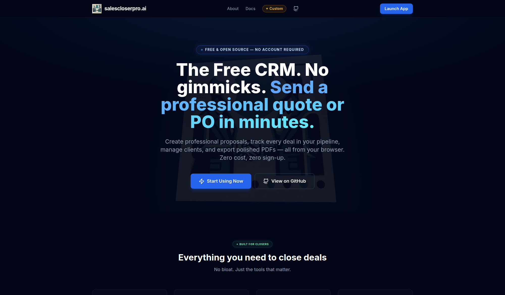

<p align="center">
  
</p>

<h1 align="center">salescloserpro.ai — Close More. Stress Less. 💪</h1>

<p align="center"><strong>Version 1.1.0 | Updated 2026-09-10</strong></p>

<p align="center">
  <strong>Free, open-source sales quoting, CRM, pipeline, purchase orders & invoicing — browser-based.</strong><br/>
  <em>Built with ⚛️ React · ⚡ Vite · 🎨 Tailwind · 🐻 Zustand — zero backend, zero sign-up, works offline.</em>
</p>

<p align="center">
  <a href="https://github.com/harborglowvintage-oss/salescloserpro.ai/blob/main/LICENSE"></a>
  <a href="https://github.com/harborglowvintage-oss/salescloserpro.ai"></a>
  <a href="https://salescloserpro.ai"></a>
  <a href="https://chatgpt.com/g/g-69930ae1d2748191a9c47556b8ceae82-salescloserpro-ai"></a>
</p>

### 📸 Screenshots

<table align="center">
  <tr>
    <td colspan="2" align="center"><strong>🏠 Homepage</strong></td>
  </tr>
  <tr>
    <td colspan="2" align="center"></td>
  </tr>
  <tr><td colspan="2"><br></td></tr>
  <tr>
    <td align="center"><strong>📋 Purchase Orders</strong></td>
    <td align="center"><strong>⚙️ Company Settings</strong></td>
  </tr>
  <tr>
    <td align="center"></td>
    <td align="center"></td>
  </tr>
  <tr><td colspan="2"><br></td></tr>
  <tr>
    <td align="center"><strong>💾 Backup &amp; Restore</strong></td>
    <td align="center"><strong>❓ Help Guide</strong></td>
  </tr>
  <tr>
    <td align="center"></td>
    <td align="center"></td>
  </tr>
  <tr><td colspan="2"><br></td></tr>
  <tr>
    <td align="center"><strong>🆕 New Quote</strong></td>
    <td align="center"><strong>🚀 Go Live Wizard</strong></td>
  </tr>
  <tr>
    <td align="center"></td>
    <td align="center"></td>
  </tr>
</table>

---

## 🆕 What's new in 1.1.0 (2026-09-10)

- 🛠️ **Data now actually persists.** The IndexedDB adapter was missing Zustand's `createJSONStorage` wrapper, so every write threw `DataCloneError` and nothing survived a reload. Fixed.
- 💾 **Backup & Restore fixed** — it was still reading the retired localStorage key (always empty) and restores were ignored on reload. Both now go through IndexedDB.
- 🔢 **Quote / PO numbers are never reused** after a delete (monotonic counters).
- 🧹 **MoonPay payments removed** — the integration never launched. A generic pay-by-link + QR code on PDFs is planned instead.
- 🖥️ **Desktop-app references removed** (web-only since June); the Go Live wizard is now 4 steps.
- 📖 **Docs rewritten to match the product** — Help Guide, About, Legal, and this README no longer describe change orders, drag-and-drop, or invoicing that were never built.
- 🌙 Theme applies before first paint again; PDFs show the quote's creation date and full state name; `/whitepaper` now redirects home.

---

## 📑 Table of Contents

- [🆕 What's new in 1.1.0](#-whats-new-in-110-2026-09-10)
- [🤖 salescloserpro.ai — GPT Assistant](#-salescloserpro-ai--gpt-assistant)
- [⚡ Quick Start — Install in 60 Seconds](#-quick-start--install-in-60-seconds)
- [🗄️ Local Zip Backup (Public Repo Safe)](#️-local-zip-backup-public-repo-safe)
- [✨ Features at a Glance](#-features-at-a-glance)
- [📸 Feature Deep Dive](#-feature-deep-dive)
  - [📝 Quote Builder](#-quote-builder)
  - [📎 File Attachments](#-file-attachments)
  - [🧮 50-State Tax Engine](#-50-state-tax-engine)
  - [📊 Sales Pipeline (Kanban)](#-sales-pipeline-kanban)
  - [🔗 Pipeline ↔ Quotes ↔ PO Integration](#-pipeline--quotes--po-integration)
  - [📦 Purchase Orders & Margin Analytics](#-purchase-orders--margin-analytics)
  - [🚚 Ship-To Address on POs](#-ship-to-address-on-pos)
  - [📄 PDF Export Engine](#-pdf-export-engine)
  - [💾 Backup & Restore](#-backup--restore)
  - [🚀 Go Live Wizard](#-go-live-wizard)
- [🌐 Deploy Your Own (Free)](#-deploy-your-own-free)
- [☁️ Cloudflare Edge Configuration](#️-cloudflare-edge-configuration)
- [✦ Custom & Enterprise Services](#-custom--enterprise-services)
- [🔍 SEO & Meta Tags](#-seo--meta-tags)
- [🛠️ Tech Stack](#️-tech-stack)
- [📁 Project Structure](#-project-structure)
- [🔧 Available Scripts](#-available-scripts)
- [🌙 Dark Mode](#-dark-mode)
- [💾 Data & Storage](#-data--storage)
- [🤝 Contributing](#-contributing)
- [❓ FAQ](#-faq)
- [⚖️ Copyright & Disclaimer](#️-copyright--disclaimer)
- [📄 License](#-license)

---

## 🤖 salescloserpro.ai — GPT Assistant

> 💬 Get instant help building quotes, closing deals, and using every feature — powered by OpenAI.

🎯 **[→ Launch salescloserpro.ai on ChatGPT](https://chatgpt.com/g/g-69930ae1d2748191a9c47556b8ceae82-salescloserpro-ai)**

The AI assistant can help you with:
- 📝 Building and editing quotes step by step
- 💡 Sales strategy & pricing advice
- 🔍 Finding features and navigating the app
- 📊 Understanding your pipeline, analytics, and margins
- 🚀 Deploying, configuring, and packaging your own instance

---

## ⚡ Quick Start — Install in 60 Seconds

### 📋 Prerequisites

| Requirement | Version | Check |
|---|---|---|
| 🟢 **Node.js** | 24+ | `node --version` |
| 📦 **npm** | 9+ | `npm --version` |
| 🌐 **Browser** | Chrome, Edge, Firefox, Safari | Any modern browser |

### 🏃 Get Running (Web)

```bash
# 1️⃣  Clone the repo
git clone https://github.com/harborglowvintage-oss/salescloserpro.ai.git
cd salescloserpro.ai

# 2️⃣  Install dependencies
npm install

# 3️⃣  Start the dev server
npm run dev
```

🎉 Open `http://localhost:5173` — **you're in!**

### 🏗️ Build for Production (Web)

```bash
# 📦 Create an optimized production build
npm run build

# 👀 Preview the production build locally
npm run preview
```

### 🗄️ Local Zip Backup (Public Repo Safe)

Use this when you want a fast local snapshot before major edits.

```bash
mkdir -p local-backups
zip -rq "local-backups/salescloserpro.ai-main-$(date +%Y%m%d-%H%M%S).zip" . \
  -x "node_modules/*" ".git/*" "dist/*" "release/*" "local-backups/*"
```

- `local-backups/` is gitignored so backups stay local and out of this public repository.
- Never include secrets, API keys, private customer data, or `.env` values in backup artifacts you share.

---

## ✨ Features at a Glance

| | Feature | Description |
|---|---|---|
| 📝 | **Quote Builder** | Big-button UI — add Products, Services, Labor, Freight with one click |
| 📎 | **File Attachments** | Drag-and-drop uploader — images and PDFs attached to any quote |
| 🧮 | **Auto Tax Engine** | All 50 US states + DC — freight, labor & sales tax rules calculated automatically |
| 👥 | **Client Manager** | Store clients, contacts, addresses, and notes — click-to-email and click-to-call |
| 📊 | **Sales Pipeline** | Kanban board — Lead → Quoted → Sent → Negotiating → Won / Lost |
| 🔗 | **Data Integration** | Quotes auto-sync to pipeline; POs link to quotes for margin analysis |
| 📦 | **Purchase Orders** | Full PO system with ship-to address, margin tracking, analytics, charts |
| 📄 | **PDF Export** | Color-neutral branded proposals & POs — charcoal palette, 50% deposit terms |
| 💾 | **Backup & Restore** | Full JSON backup with auto-schedule, File System Access API, Firefox-safe |
| 🚀 | **Go Live Wizard** | 4-step guide: GitHub → Cloudflare → Domain → Email |
| 🏢 | **Company Settings** | Logo upload, company info, branding for all PDF exports |
| ❓ | **Help Center** | 11-section searchable guide with expandable FAQs |
| 🌙 | **Dark / Light Mode** | One-click theme toggle (dark by default), persisted locally, balanced for both modes |
| 🔍 | **SEO Ready** | Open Graph, Twitter Cards, JSON-LD structured data out of the box |

---

## 📸 Feature Deep Dive

### 📝 Quote Builder
> 🎯 The heart of SalesCloserPro — create professional quotes in minutes, not hours.

- ➕ **One-click line items** — Products, Services, Labor, Freight categories
- 🔢 **Auto-numbering** — Sequential quote numbers (Q-0001, Q-0002 …) that are never reused
- 🧮 **Real-time totals** — Subtotal, tax, and grand total update instantly
- 👤 **Client details** — Name, email, phone, and state captured on every quote (state drives the tax rules)
- 📝 **Notes & terms** — Free-text notes printed on the PDF
- 📎 **File attachments** — Drag-and-drop images, PDFs, specs to any quote (see below)
- 📄 **PDF export** — One-click branded proposal generation
- 🔗 **Pipeline sync** — Saving a quote automatically creates or updates the connected pipeline deal

### 📎 File Attachments
> 📂 Attach supporting documents to any quote — images, PDFs, and spec sheets.

- 🖱️ **Drag-and-drop** — or click to browse; supports images (JPEG, PNG, GIF, WebP) and PDFs
- 📏 **Size limits** — max 5 files per quote, max 2 MB per file
- 🖼️ **Visual thumbnails** — centered preview grid so you can see what you attached
- 🗑️ **Remove** — click the ✕ on any thumbnail to detach
- 💾 **Persisted** — attachments are saved with the quote in Zustand (base64 in IndexedDB)
- 🖨️ **Print-ready** — image attachments are embedded in the PDF; PDF attachments are listed by name

### 🧮 50-State Tax Engine
> 🇺🇸 Automatic sales tax calculations for all 50 US states + Washington DC.

- ✅ State-level sales tax rates for every US state
- 🚚 **Freight taxability** — knows which states tax shipping
- 🔧 **Labor taxability** — knows which states tax labor/services
- 🔄 **Auto-calculation** — tax updates in real-time as you edit quotes
- 📊 **Rate accuracy** — community-updatable table in `src/data/taxDatabase.js` (2025 rates — verify with your accountant)

### 📊 Sales Pipeline (Kanban)
> 🏗️ Visual deal tracking from first contact to closed-won.

- 🎯 **6 stages** — Lead → Quoted → Sent → Negotiating → Won → Lost
- 🎨 **Color-coded stages** — each stage has a distinct background color in both light and dark mode
- 🖱️ **Click-to-move** — advance deals through stages with one click
- 💰 **Deal values** — track expected revenue per deal
- 📝 **Notes** — add context notes to any deal
- 🔗 **Quote linking** — linked deals show the quote number and badge the connected PO
- 📈 **Aging cues** — cards turn amber after 7 days and red after 14 so stale deals stand out
- 🌗 **Balanced modes** — rich card shadows and stage backgrounds in light mode, vibrant colors in dark mode

### 🔗 Pipeline ↔ Quotes ↔ PO Integration
> 🔄 All data flows together — quotes, pipeline deals, and purchase orders are fully connected.

- 📝 **Saving a quote** → automatically creates a pipeline deal (or updates the existing one)
- 💰 **Deal value** = quote grand total, always in sync
- 📊 **Pipeline stage** follows the quote status — Draft → Quoted, Sent → Proposal Sent, Won → Closed Won, Lost → Closed Lost
- 🏷️ **Deal cards** display linked quote number and PO badge
- 🔄 **Startup sync** — `syncAllQuotesToPipeline()` runs on app mount to reconcile all data

**How it works under the hood:**

| Action | Store Method | Result |
|---|---|---|
| Save/update a quote | `syncQuoteToPipeline(quoteId)` | Creates or updates pipeline deal with matching `quoteId`, sets value to grand total |
| App start | `syncAllQuotesToPipeline()` | Iterates all quotes and syncs each to the pipeline |
| Link PO to quote | Read at render | Deal card shows a PO badge; margin analytics update |

### 📦 Purchase Orders & Margin Analytics
> 📈 Track costs, calculate margins, and visualize profitability.

- 📋 **PO creation** — vendor, vendor contact, description, quantity, and unit cost (one line per PO)
- 🚚 **Ship-to address** — dedicated field for delivery destination (see below)
- 🔗 **Quote linking** — tie POs to quotes for automatic margin analysis
- 📊 **Charts** — cost by line type, margin % by quote, sell vs. cost by quote
- 📈 **Analytics dashboard** — total cost, total sell, average margin, count
- 🔍 **Search & filter** — find POs by vendor, quote, status, or keyword
- 📄 **PDF export** — professional PO document with all details and terms

### 🚚 Ship-To Address on POs
> 📍 Specify a delivery destination that is different from your company address.

- 📝 **Dedicated field** — "Ship To Address" input in the PO form, between Vendor Contact and Description
- 📄 **PDF support** — if a ship-to address is provided, the PO PDF prints it as the delivery address; if left blank, it falls back to your company address from Company Settings
- 🔄 **Edit support** — ship-to address is preserved when editing an existing PO
- 🗑️ **Reset** — cleared when the form is reset for a new PO

### 📄 PDF Export Engine
> 🖨️ Professional, color-neutral documents generated entirely client-side — no cloud, no API.

Both the **Quote/Proposal PDF** and the **Purchase Order PDF** share a refined design:

#### 🎨 Design Language
- **Color-neutral palette** — charcoal, gray, and white — no blue or colored branding
- **Charcoal table headers** — dark header row with white text for clarity
- **Charcoal total band** — grand total row with the same dark treatment
- **Wider margins** — 16 mm on all sides for a clean, breathable layout
- **Page numbers** — "Page X of Y" in the footer of every page
- **Company branding** — your logo and company info at the top of every document

#### 📝 Quote / Proposal PDF (`generatePDF`)
- Itemized table with description, quantity, unit price, total
- Subtotal, tax, and grand total summary
- **Terms & Payment section** — printed at the bottom of every quote:
  - 💰 50% deposit due upon acceptance of the proposal
  - 💳 Remaining balance due net 30 days from date of invoice
  - 📅 Proposal valid for 30 days from the date shown
- **Attachments** — image thumbnails embedded, PDF attachments listed by name

#### 📦 Purchase Order PDF (`generatePO_PDF`)
- Vendor details, PO number, date
- Ship-to address (or company address fallback)
- Itemized table with description, quantity, unit cost, total
- **No margin summary** — margins are internal analytics only, never shown on the PO document
- **Terms & Conditions block** with 5 terms:
  1. 🔖 Reference the PO number on all correspondence, invoices, and shipping documents
  2. 📦 Deliver to the Ship To address unless otherwise specified
  3. ⚠️ Vendor must notify buyer immediately of delays or changes
  4. 💰 50% deposit on PO issuance; balance net 30 from receipt of goods and valid invoice
  5. 📜 Subject to the terms agreed between buyer and vendor
- **Signature lines** — Authorized By and Date fields

### 💾 Backup & Restore
> 🛡️ Never lose your data — comprehensive backup system with auto-scheduling.

- 📥 **One-click download** — full JSON export of all data
- 📤 **File restore** — import any backup JSON to restore data
- 📂 **Folder backup** — save directly to a folder (Chrome/Edge, File System Access API)
- ⏰ **Auto-schedule** — set backup intervals (hourly, daily, weekly)
- 📊 **Backup history** — track when, where, and how large each backup was
- ⚠️ **Restore confirmation** — safety prompt before overwriting data
- 🦊 **Firefox-safe** — download uses delayed `revokeObjectURL` for cross-browser compatibility

### 🚀 Go Live Wizard
> 🌐 Deploy your own SalesCloserPro instance in 4 easy steps.

1. 🐙 **GitHub** — Fork the repo and push your customizations
2. ☁️ **Cloudflare Pages** — Free hosting with automatic deployments
3. 🌍 **Custom Domain** — Connect your own domain name
4. 📧 **Business Email** — Set up professional email (Zoho / Google)

---

## 🌐 Deploy Your Own (Free)

### 1️⃣ Fork this repo
> 🍴 Click **Fork** at the top of this page. You own your copy forever.

### 2️⃣ Deploy to Cloudflare Pages

1. 🌐 Go to [pages.cloudflare.com](https://pages.cloudflare.com) → **Create project** → **Connect GitHub**
2. 📂 Select your forked repo
3. ⚙️ Build settings:
   - 🏗️ Framework: **Vite**
   - 📜 Build command: `npm run build`
   - 📁 Output directory: `dist`
4. 🚀 Click **Save and Deploy** — live in ~60 seconds at `yourproject.pages.dev`

> ✅ Free SSL · ✅ Free CDN · ✅ Auto-deploys on every push · ✅ Unlimited bandwidth

### 3️⃣ Custom Domain (optional)
> 🌍 Add your domain in Cloudflare Pages → Custom Domains.

Use [Cloudflare DNS](https://cloudflare.com/dns) for free DNS management. Point your domain in minutes.

### 4️⃣ Business Email (optional)

| | Option | Cost | Link |
|---|---|---|---|
| ⭐ | **Zoho Mail** (recommended) | ~$2/mo | [zoho.com/mail](https://www.zoho.com/mail/) |
| 📧 | Google Workspace | ~$6–12/mo | [workspace.google.com](https://workspace.google.com) |

---

## ☁️ Cloudflare Edge Configuration

Production edge behavior is managed in Cloudflare and should be treated as part of the app configuration.

### Security headers and CSP

- Response headers (including `Content-Security-Policy`) are managed by **Cloudflare Response Header Transform Rules**.
- `public/_headers` in this repo is the source-of-truth fallback for Cloudflare Pages and local reference.
- Keep Cloudflare dashboard header rules and `public/_headers` synchronized whenever security headers are changed.

### Edge routing and worker notes

- `robots.txt` and `.well-known/security.txt` are served via Cloudflare edge routing/worker logic.
- Keep exact route expressions, worker script names, and account-level rule details in private operations documentation (not in this public repo).
- After any edge-rule change, verify both public crawler endpoints and security-contact endpoints are still reachable.

### Public repo safety guidelines

- Do not commit API tokens, account IDs, zone IDs, or dashboard export payloads.
- Do not publish full Cloudflare rule expressions if they reveal internal routing or abuse controls.
- Keep this README focused on operational intent; keep implementation specifics in a private runbook.

---

## ✦ Custom & Enterprise Services

> **Need more than the free version?** We offer private technical partnerships for businesses that need a tailored implementation.

Visit **[salescloserpro.ai/services](https://salescloserpro.ai/services)** for full details.

### What we offer

| Service | Description |
|---|---|
| 🔧 **Custom Configuration & Build** | Platform scoped and extended to match your exact workflow — data structure, automations, and feature additions built around how your team operates |
| 🏢 **White-Label & Enterprise Architecture** | Full rebrand of the interface for your franchise or sales floor — stripped default branding, rebuilt around your corporate identity |
| 🛟 **Setup, Onboarding & Consulting** | Hands-on deployment, data migration, and team onboarding — implementation done right the first time |
| 🤝 **Ongoing Partnership & Support** | Retainer-based engagement with dedicated responsiveness, roadmap input, and continuous refinement |

### How it works

1. **Describe** — Tell us what you need. No forms, no chatbots. Just a conversation.
2. **Scope** — We assess feasibility, define deliverables, and present a clear proposal.
3. **Execute** — Work begins with direct communication and full transparency.

> Engagements typically start at **$2,500**. Contact **brent@llmadvisor.ai** or click **Request a Build Conversation** on the [services page](https://salescloserpro.ai/services).

---

## 🔍 SEO & Meta Tags

The `index.html` ships with production-ready SEO markup so search engines and social platforms display your site correctly out of the box:

| Category | Tags Included |
|---|---|
| 🔍 **Primary SEO** | `<title>`, `meta description`, `meta keywords`, `meta robots`, `link canonical`, `meta author` |
| 🌐 **Open Graph** | `og:type`, `og:url`, `og:title`, `og:description`, `og:image`, `og:site_name`, `og:locale` |
| 🐦 **Twitter Cards** | `twitter:card` (summary_large_image), `twitter:url`, `twitter:title`, `twitter:description`, `twitter:image` |
| 📊 **Structured Data** | JSON-LD `SoftwareApplication` schema — name, description, category, OS, price (free), author, license |
| 🎨 **App Meta** | `theme-color` (#0f172a), Apple touch icon, favicon (ICO + PNG), web app manifest |

> 💡 To customize for your fork: update the `canonical` URL, `og:url`, `og:image`, `twitter:url`, and `twitter:image` in `index.html` to point to your domain.

---

### 🚨 Active Ranking — What's Working (Do Not Modify Without Understanding)

**Last verified:** April 10, 2026 — salescloserpro.ai ranks **#1 on Google** for `salescloserpro` organically.

> ℹ️ On 2026-09-10 the title, description, and H1 were refreshed to drop retired claims (desktop app, payments, usage figures). Re-verify ranking after the next crawl.

This section documents the exact signals Google has indexed and is actively rewarding. Before changing any of the values below, understand that Google re-evaluates the page on the next crawl cycle. Even "safe-looking" edits to these fields can cause ranking fluctuation that takes weeks to recover.

#### 🔒 Do Not Change — Core Ranking Signals

| Signal | Current Value | Location | Risk if Changed |
|--------|--------------|----------|-----------------|
| **`<title>`** | `SalesCloserPro.ai \| The Free CRM. No gimmicks. Send a professional quote and/or PO in minutes` | `index.html` | Direct ranking impact — this exact phrasing is indexed |
| **`meta description`** | `Build professional quotes, track deals, issue POs, and export polished PDFs — 100% free and open source. No login required. Built for freelancers, contractors, and small businesses.` | `index.html` | Changes the snippet shown in search results |
| **`H1` text** | `The Free CRM. No gimmicks. Send a professional quote or PO in minutes.` | `LandingPage.jsx` | H1 must semantically match the title tag intent |
| **`link rel="canonical"`** | `https://salescloserpro.ai/` | `index.html` | Changing domain/path tells Google to re-index a "new" page |
| **`og:image`** | `https://salescloserpro.ai/og-cover-v2.png` | `index.html` | This image is actively cached by Google, social platforms, and chat previews |
| **JSON-LD `SoftwareApplication`** | Type: `SoftwareApplication`, Category: `BusinessApplication / CRM Software`, Price: `0` | `index.html` | Structured data drives rich result eligibility — don't rename fields |
| **`meta keywords`** | `free CRM, sales quoting tool, proposal builder, pipeline management...` | `index.html` | Low direct impact but part of the indexed document fingerprint |

#### ✅ Safe to Change Below the Fold

These elements are in the footer or below the visible viewport. Google discounts footer content for primary ranking signals. Changes here carry low SEO risk:

- Footer copyright text and timestamp
- Social links and "Built by" attribution

#### ⚠️ What Triggers a Google Re-Evaluation

- Any change to `<title>`, `meta description`, or `H1` — even minor rewording
- Changing the `canonical` URL
- Adding/removing `meta robots` directives
- Replacing the JSON-LD schema `@type` or removing fields
- Changing `og:image` to a new file (social cache takes 7–14 days to refresh)
- Deploying to a new domain without a 301 redirect chain

---

## 🛠️ Tech Stack

### 📦 Runtime Dependencies

| | Technology | Version | Purpose |
|---|---|---|---|
| ⚛️ | **React** | 18.3 | UI component library |
| ⚛️ | **React DOM** | 18.3 | React renderer for the browser |
| 🧭 | **React Router DOM** | 6.22 | SPA navigation (BrowserRouter; Cloudflare Pages serves index.html for deep links) |
| 🐻 | **Zustand** | 4.5 | Lightweight state management + IndexedDB persist middleware |
| 🗄️ | **Dexie.js** | 4.x | IndexedDB wrapper — scalable local storage for 50,000+ records |
| 📄 | **jsPDF** | 2.5 | Client-side PDF generation |
| 📊 | **jspdf-autotable** | 3.8 | PDF table formatting with auto-pagination |
| 📅 | **date-fns** | 3.6 | Lightweight date formatting & manipulation |
| 🎯 | **Lucide React** | 0.378 | Beautiful, consistent SVG icon library |
| 🔧 | **clsx** | 2.1 | Conditional class name utility |

### 🔧 Dev Dependencies

| | Technology | Version | Purpose |
|---|---|---|---|
| ⚡ | **Vite** | 5.2 | Lightning-fast build tool & HMR dev server |
| ⚛️ | **@vitejs/plugin-react** | 4.2 | React Fast Refresh + JSX transform |
| 🎨 | **Tailwind CSS** | 3.4 | Utility-first CSS framework with dark mode (`class` strategy) |
| 🔄 | **PostCSS** | 8.4 | CSS processing pipeline |
| 🌐 | **Autoprefixer** | 10.4 | Automatic vendor prefixes |
| 📋 | **@types/react** | 18.3 | TypeScript type definitions for React (IDE support) |
| 📋 | **@types/react-dom** | 18.3 | TypeScript type definitions for React DOM (IDE support) |

### 🏗️ Architecture Highlights

- 🏠 **Local-first** — all data stored in IndexedDB (via Dexie.js), no server required
- 🔒 **No accounts** — zero authentication, zero sign-up friction
- 📱 **Responsive** — works on desktop, tablet, and mobile
- 🌙 **Dark mode** — dark by default with a manual toggle, preference persisted
- 🗂️ **Browser routing** — clean URLs with SPA fallback on Cloudflare Pages
- 📦 **Zero cloud dependency** — PDFs generated client-side, no external APIs for core features
- 🔗 **Integrated data** — quotes, pipeline, and POs are cross-linked and auto-synced
- 🔍 **SEO-ready** — Open Graph, Twitter Cards, and JSON-LD baked into index.html

---

## 📁 Project Structure

```
📦 salescloserpro/
├── 📄 index.html                → App shell — SEO meta, OG tags, JSON-LD, dark-mode pre-paint
├── 📄 package.json              → Dependencies, scripts, author info, version
├── 📄 vite.config.js            → Vite config — React plugin, vendor chunks, __APP_VERSION__
├── 📄 tailwind.config.js        → Tailwind CSS config (dark mode: 'class')
├── 📄 postcss.config.js         → PostCSS pipeline (Tailwind + Autoprefixer)
├── 📂 scripts/
│   └── 📄 generate-og.mjs       → Regenerates public/og-cover-v2.png (1200×630) with sharp
├── 📂 public/
│   ├── 🖼️ favicon.ico · favicon-32.png · apple-touch-icon.png · icon-192.png · icon-512.png
│   ├── 📄 manifest.webmanifest  → Web app manifest (installable, standalone)
│   ├── 🖼️ og-cover-v2.png       → Social share card
│   ├── 🖼️ salescloserpro-logo.svg → Default sidebar logo
│   ├── 🖼️ gptlogo.png           → GPT assistant card logo
│   ├── 📂 logos/                → Landing page artwork
│   ├── 📄 _headers              → Cloudflare Pages cache + security headers
│   ├── 📄 _redirects            → Retired-page redirects + SPA fallback
│   └── 📄 sitemap.xml
└── 📂 src/
    ├── 📄 main.jsx              → ⚡ Entry point — legacy localStorage migration, renders <App />
    ├── 📄 App.jsx               → 🧭 Router + startup sync (syncAllQuotesToPipeline)
    ├── 📄 store.js              → 🐻 Zustand global state — quotes, clients, pipeline, POs, settings, counters
    ├── 📄 db.js                 → 🗄️ Dexie/IndexedDB storage adapter + raw export/import for backups
    ├── 📄 index.css             → 🎨 Tailwind base + custom utilities
    ├── 📂 components/
    │   ├── 📂 backup/BackupRestore.jsx     → 💾 Download, save-to-folder, auto-schedule, restore
    │   ├── 📂 clients/Clients.jsx          → 👥 Client address book — add, edit, search, notes
    │   ├── 📂 dashboard/Dashboard.jsx      → 📊 KPI cards, recent quotes, pipeline overview
    │   ├── 📂 help/HelpGuide.jsx           → ❓ 11-section searchable help center
    │   ├── 📂 landing/                     → 🌐 LandingPage, AboutPage, ServicesPage, LegalPage
    │   ├── 📂 layout/Layout.jsx            → 🏗️ Sidebar, mobile header, theme toggle, GPT card
    │   ├── 📂 pipeline/Pipeline.jsx        → 📈 Kanban board — 6 stages, deal cards, Move/Back
    │   ├── 📂 po/PurchaseOrders.jsx        → 📦 POs — form, list, margin table, charts, PDF
    │   ├── 📂 quotes/QuoteBuilder.jsx      → 📝 Quote form — line items, tax, notes, attachments, PDF
    │   ├── 📂 quotes/QuoteList.jsx         → 📋 All quotes — search, status, delete
    │   ├── 📂 quotes/FileUploader.jsx      → 📎 Drag-and-drop attachments (max 5 × 2 MB)
    │   ├── 📂 settings/CompanySettings.jsx → 🏢 Company info, logo, home state
    │   └── 📂 wizard/GoLiveWizard.jsx      → 🚀 4-step self-hosting checklist
    ├── 📂 data/taxDatabase.js   → 🧮 All 50 states + DC: rates, freight rules, labor rules
    └── 📂 utils/pdfExport.js    → 📄 PDF engine — generatePDF() + generatePO_PDF()
```

---

## 🔧 Available Scripts

### 🌐 Web Development

| Command | Description |
|---|---|
| 🏃 `npm run dev` | Start the Vite dev server with hot module replacement |
| 📦 `npm run build` | Create an optimized production build in `dist/` |
| 👀 `npm run preview` | Preview the production build locally |

---

## 🌙 Dark Mode

SalesCloserPro ships with a **fully integrated dark mode** experience:

- 🎨 **Dark by default** — the app opens in dark mode on first visit
- 🔘 **Manual toggle** — switch between light/dark from the sidebar
- 💾 **Persisted** — saved with the rest of your data in IndexedDB, plus a tiny localStorage mirror (`scp-theme`) for the pre-render script
- 🖥️ **Flash-free** — a pre-render script in `index.html` prevents white flash on dark mode load
- 🎯 **Full coverage** — every component, modal, card, input, chart, and pipeline stage has dark variants
- 🎨 **Balanced light mode** — stronger card shadows, richer stage backgrounds for pipeline cards
- 🌈 **Color-coded pipeline** — each stage (Lead, Quoted, Sent, Negotiating, Won, Lost) has distinct, carefully tuned colors in both modes

> 💡 **Tip:** Dark mode is controlled via the `class` strategy in Tailwind. A `dark` class is toggled on the `<html>` element. The pre-flash script reads the `scp-theme` localStorage mirror (IndexedDB is asynchronous, so it can't be read before first paint).

---

## 💾 Data & Storage

### 🏗️ How It Works

SalesCloserPro stores **all data locally** in your browser's **IndexedDB** via [Dexie.js](https://dexie.org) (upgraded from localStorage in v1.0.1):

| Data | Storage Key | Details |
|---|---|---|
| 🏢 Company settings | `salescloserpro-data` | Name, address, logo, branding |
| 👥 Clients | `salescloserpro-data` | All CRM contacts and addresses |
| 📝 Quotes | `salescloserpro-data` | Quotes, line items, totals, attachments (base64) |
| 📊 Pipeline deals | `salescloserpro-data` | Kanban stage, value, notes, linked quoteId |
| 📦 Purchase orders | `salescloserpro-data` | POs, costs, vendor info, ship-to address |
| 🚀 Go Live checklist | `salescloserpro-data` | Wizard completion status |
| 💾 Backup settings | `salescloserpro-data` | Auto-backup config, schedule & history |
| 🌙 Theme preference | `salescloserpro-data` | `"dark"` or `"light"` |

> ⚠️ **Important:** Since data lives in IndexedDB, clearing browser data will erase everything. Use the **Backup & Restore** feature regularly!

> 🔄 **Automatic migration:** Existing `localStorage` data is seamlessly migrated to IndexedDB on first load — no manual steps needed.

### 📊 Storage Limits

| Browser / Runtime | IndexedDB Limit | Old localStorage Limit |
|---|---|---|
| 🌐 Chrome / Edge | **Up to 80% of disk** | ~5 MB |
| 🦊 Firefox | **Up to 2 GB+** | ~5 MB |
| 🧭 Safari | **Up to 1 GB** | ~5 MB |

> 💡 With IndexedDB, you can store **tens of thousands of quotes, clients, and attachments** without hitting limits. The old 5 MB cap is gone — file attachments, audit history, and large datasets all fit comfortably.

### 🔄 Data Sync

The integrated data sync ensures consistency across modules:

| Event | Sync Action |
|---|---|
| 📝 Quote saved | Pipeline deal created/updated with matching value |
| 🚀 App starts | All quotes synced to pipeline |
| 📦 PO linked to quote | Deal card shows a PO badge; margin analytics update |

---

## 🤝 Contributing

🎉 **Pull requests welcome!** Here are some great areas to contribute:

| | Area | Description |
|---|---|---|
| 🧮 | **Tax data updates** | State rates change — open a PR with sources cited |
| 📝 | **Quote templates** | Industry-specific line item presets (HVAC, electrical, plumbing, etc.) |
| 🌍 | **Translations / i18n** | Help make SalesCloserPro available globally |
| 🎨 | **Themes** | Brand color presets beyond light/dark |
| 💳 | **Pay-by-link** | A payment link + QR code on quote PDFs (Stripe, PayPal, Square, etc.) |
| ♿ | **Accessibility** | Screen reader improvements, keyboard navigation |
| 🧪 | **Tests** | Unit tests, integration tests, E2E tests |
| 📖 | **Documentation** | Tutorials, video guides, API docs |

### 📋 Contribution Guidelines

1. 🍴 **Fork** the repository
2. 🌿 **Create** a feature branch: `git checkout -b feature/my-feature`
3. ✏️ **Commit** your changes: `git commit -m "feat: add my feature"`
4. 📤 **Push** to your branch: `git push origin feature/my-feature`
5. 🔀 **Open** a Pull Request with a clear description

> 💡 Please follow [Conventional Commits](https://www.conventionalcommits.org/) for commit messages.

---

## ❓ FAQ

<details>
<summary>🔒 Is my data secure?</summary>

✅ **Yes!** All data stays in your browser's IndexedDB. Nothing is sent to any server. The only outbound requests are the site itself (Cloudflare) and the Inter font from Google Fonts; optional links (GitHub, the ChatGPT GPT) open in a new tab.
</details>

<details>
<summary>📱 Does it work on mobile?</summary>

✅ **Yes!** SalesCloserPro is fully responsive and works on phones, tablets, and desktops. The UI adapts gracefully to smaller screens with a collapsible sidebar and mobile-optimized layouts.
</details>

<details>
<summary>🌐 Can I use my own domain?</summary>

✅ **Yes!** Deploy to Cloudflare Pages (free) and add your custom domain in the Cloudflare dashboard. The Go Live Wizard walks you through every step.
</details>

<details>
<summary>💰 Is it really free?</summary>

✅ **Yes!** SalesCloserPro is free and open source under the Apache 2.0 license. Hosting on Cloudflare Pages is also free. The only optional costs are a custom domain (~$10/year) and business email (~$2/month).
</details>

<details>
<summary>🔄 How do I update to the latest version?</summary>

If you forked the repo, sync your fork with the upstream repository. Cloudflare Pages will auto-deploy the update.

```bash
git remote add upstream https://github.com/harborglowvintage-oss/salescloserpro.ai.git
git fetch upstream
git merge upstream/main
git push origin main
```
</details>

<details>
<summary>🖨️ Can I customize the PDF quotes and POs?</summary>

✅ **Yes!** Upload your company logo and fill in your business details in **Company Settings**. The PDF export uses your branding automatically. The PDFs use a color-neutral charcoal palette with 50% deposit terms. For deeper customization, edit `src/utils/pdfExport.js`.
</details>

<details>
<summary>📎 How do file attachments work?</summary>

The **FileUploader** component in the Quote Builder lets you drag-and-drop or browse for files (images and PDFs). Each quote supports up to 5 files, max 2 MB each. Files are stored as base64 strings inside the Zustand store (IndexedDB). They appear as large, centered thumbnails in the form.
</details>

<details>
<summary>🧮 Are the tax rates accurate?</summary>

The tax database covers all 50 US states + DC with general state-level rates, including freight and labor taxability rules. ⚠️ Rates may change — always verify with a licensed tax professional. Community PRs to update rates are welcome!
</details>

<details>
<summary>💾 What if I clear my browser data?</summary>

⚠️ Clearing browser/site data will erase all SalesCloserPro data (stored in IndexedDB). Use the **Backup & Restore** feature to regularly export your data. Enable auto-backup for peace of mind.
</details>

<details>
<summary>🚚 Can I set a ship-to address on purchase orders?</summary>

✅ **Yes!** The PO form includes a "Ship To Address" field. When provided, the PO PDF uses it as the delivery address. If left blank, the PDF falls back to your company address from Company Settings.
</details>

<details>
<summary>📊 Why don't PO PDFs show margin data?</summary>

By design, margin data (cost vs. sell, margin %) is for internal analytics only and is **never** printed on the PO PDF. This keeps your margins confidential when sending POs to vendors.
</details>

---

## ⚖️ Copyright & Disclaimer

```
Copyright 2024-2026 SalesCloserPro / llmadvisor.ai

Licensed under the Apache License, Version 2.0 (the "License");
you may not use this file except in compliance with the License.
You may obtain a copy of the License at

    http://www.apache.org/licenses/LICENSE-2.0

Unless required by applicable law or agreed to in writing, software
distributed under the License is distributed on an "AS IS" BASIS,
WITHOUT WARRANTIES OR CONDITIONS OF ANY KIND, either express or implied.
See the License for the specific language governing permissions and
limitations under the License.
```

⚠️ **Disclaimer:** This software is provided "as is" without warranty of any kind. The authors and contributors are not responsible for any damages, data loss, financial loss, or other liabilities arising from the use of this software. Tax calculations are approximations — always verify with a licensed tax professional.

---

## 🏛️ Trademark & Attribution

**SalesCloserPro** is a project of **LLMadvisor ai LLC**. The "SalesCloserPro" name and logo are the property of LLMadvisor ai LLC.

While this software is **open-source under Apache-2.0**, the **SalesCloserPro** name and logo branding are reserved.

### For Contributors:
- ✅ You may contribute code to this project
- ✅ Your contributions remain under Apache 2.0
- See [CONTRIBUTING.md](CONTRIBUTING.md) for guidelines

### For Forks:
If you fork this project, you **must**:
- ✅ Maintain attribution to the original SalesCloserPro project
- ✅ Keep the Apache 2.0 license intact
- ❌ **Remove the SalesCloserPro name and logo branding** and rebrand under a different name

**Example fork attribution:**
```
Based on SalesCloserPro by LLMadvisor ai LLC
Original: https://github.com/harborglowvintage-oss/salescloserpro.ai
Licensed under Apache-2.0
```

See [NOTICE](NOTICE) for full attribution requirements.

---

## 📄 License

**📜 Apache License 2.0** — free for personal and commercial use. See [LICENSE](LICENSE) for the full text.

✅ You may **use**, **modify**, and **distribute** this software. Attribution is required. The license includes a patent grant.

---

<p align="center">
  <strong>🚀 salescloserpro — Close More. Stress Less. 💪</strong><br/>
  <em>⚡ A project of <a href="https://llmadvisor.ai">LLMadvisor ai LLC</a></em>
</p>

<p align="center">
  <a href="https://chatgpt.com/g/g-69930ae1d2748191a9c47556b8ceae82-salescloserpro-ai">🤖 salescloserpro.ai GPT</a> ·
  <a href="https://salescloserpro.ai">🌐 salescloserpro.ai</a> ·
  <a href="https://llmadvisor.ai">⚡ llmadvisor.ai</a>
</p>

<p align="center">
  ⭐ <strong>If SalesCloserPro helps you close more deals, give it a star!</strong> ⭐
</p>
